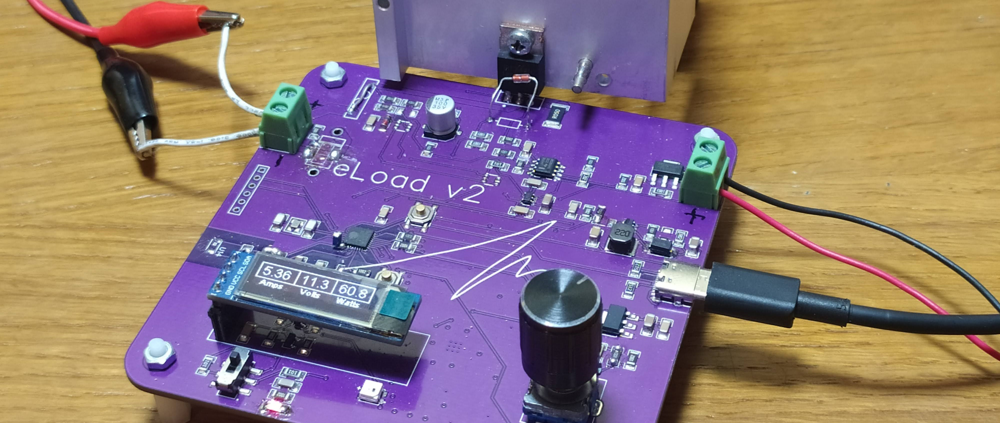
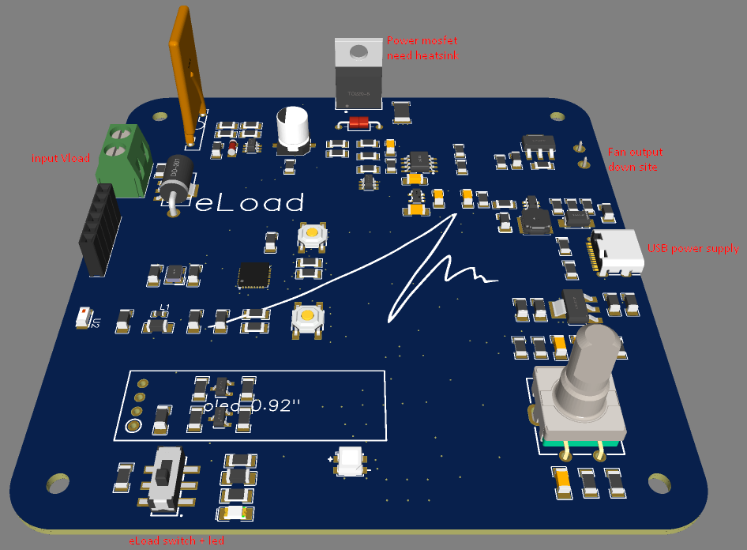
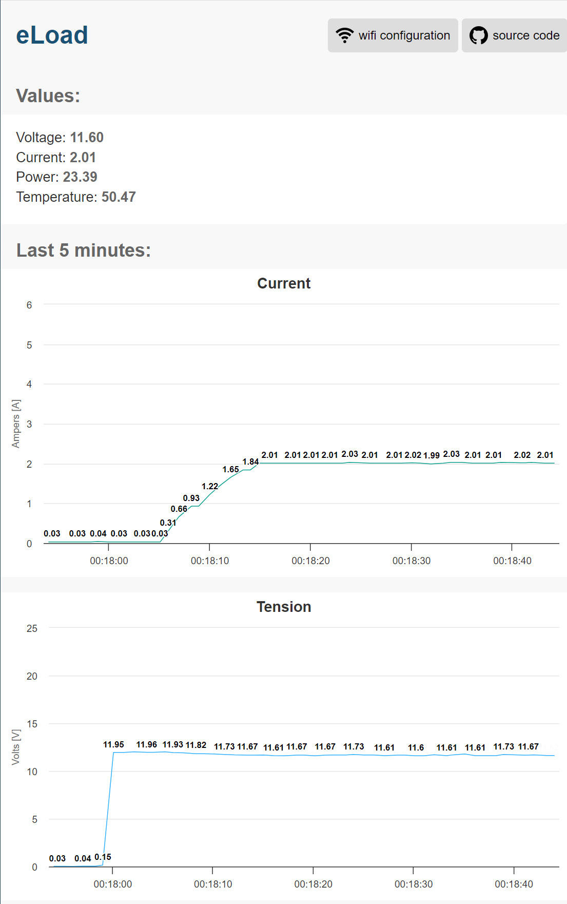
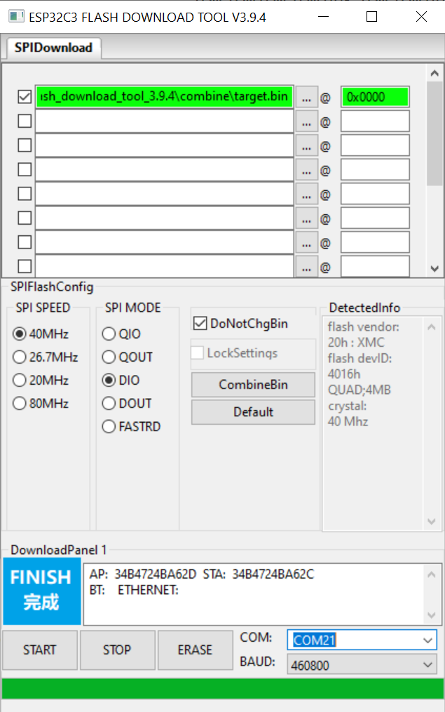
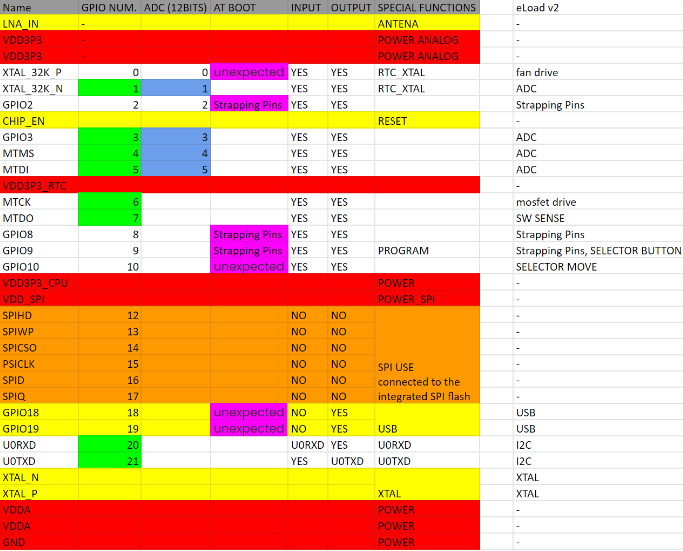

[__Project published on OSHWLAB__](https://oshwlab.com/canmarques/electronic-load_v2_copy)

# Electronic Load - 60W

This is a DIY project aimed at providing a practical, useful  and safe electronic load for people interested in electronics. While it is not be the most powerful electronic load available, it is designed to be easy to use and reliable, making it an excellent option for those looking for a DIY electronic load. We develop a HW and SW for complete integration, but you can use it as you want. Based in microcontroller ESP32-C3.

---

## Purpose

This project is designed for people who want to build their own electronic load for testing and evaluating power supplies, batteries, and other electronic components. It is a practical and affordable solution for those who do not want to spend a lot of money on a commercial electronic load but still want to have a reliable tool for their electronic projects.

## Features

The __Electronic Load - 60W__ has several features that make it a practical and useful tool, including:

- __25Vdc__ maximum voltage
- __5A__ maximum current
- __60W__ power output (_12V/5A_, depending on cooling system, Fan needed!!)
- Based in microcontroller __ESP32-C3__
- Reverse polarity voltage protection
- __Thermal protection__ to prevent avalanche breakdown due to temperature
- Overcurrent and overvoltage protection
- Adjustable current, voltage and power settings by fisical selector
- Switch to dis/enable load functions
- Easy-to-read display for current, voltage and power monitoring
- Easy-to-configure wifi _ssid_ and _psk_
- __Live graphic on web__ for current, tension and power monitoring
- Cooling fan output, 12Vdc/0.5A
- It is powered by a typical 5V USB-C power source

---

## Board connections
- USB to power up the LV site of board
- Vload input, where to connect the power supply to apply the load
- Power mosfet, is the main component that works in resistence part to to vary its resistance. I need a heatsink !!
- Fan output, to healp heatsink control mosfet temperature. For low power applications and having a good heatsink maybe it is not needed.
- eLoad switch enable and disable the mosfet gate directly, to stop or let run the load.

---

## Monitoring web
When you plug in the USB power to eLoad electronics, it will start and in a few seconds will show a IP (if it can connecto to the wifi) or it wil generate an AP wifi (where you can configure wifi, if you want). At any case, you will see this website.

---

## Burning firmware
There are two different ways to do that, the easy&fast (using bin file) or the advance (using PlatformUO)

### Easy&Fast
- Download [Last eLoad Release](https://github.com/CanMarques/eLoad/releases)
- Download [Flash Download Tools](https://www.espressif.com/en/support/download/other-tools?keys=flash+download+tools) from ESPRESSIF
- Open Flash Download Tools -> _ESP32-C3 / Develop / USB_

---

## GPIOs
|Function|GPIO|Mode|
|---|---|---
|Cooling fan|0|Output|
|ADC-Isense|1|Input|
|Digital led|2|Output|
|ADC-Vsense|3|Input|
|ADC-Tsense1|4|Input|
|Mosfet|6|Output|
|Sw sense|7|Input|
|Selector move B|8|Input|
|Selector button|9|Input|
|Selector move A|10|Input|
|I2C-SCL|20|Communication|
|I2C-SDA|21|Communication|

### Pin Details of ESP32-C3

---

## Safety

Safety is a top priority in the design of the Electronic Load - 60W. It includes HW and SW protections: HW

Resettable fuse of 6A, for overcurrent of load
Thermoswitch,
Opam,
Main switch
Thermistor sensor,
Fan
SW

Thermistor monitoring for turn on the fan when temperature increase over 50ºC and turn of pwm signal when it is over 100.
overcurrent and overvoltage protection, and is designed to be safe and reliable for DIY enthusiasts.

---

## Accuracity

It is the weak point of the ESPRESSIF microcontrollers, the internal ADC it is not accurate. In my tests, the error can be up to 10% of error, and it can change in the time. In the PCB design exist de option the use an external ADC for monitor Voltage and Current (not for temperature).

---

## To do
- Get log file .csv, via web, sd card or usb to pc
- Program option to setting up load profile in the time
- Batteries calculations
- Design of 3D printable box
